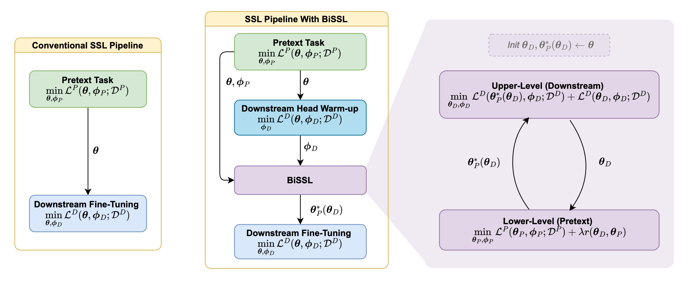

# BiSSL: A Bilevel Optimization Framework for Enhancing the Alignment Between Self-Supervised Pre-Training and Downstream Fine-Tuning
This repository holds the pytorch-implementation accompanying the paper on BiSSL (submitted to ICML 25). The implementation is verified to work for single-node multi-gpu (cuda) setups.


## Pre-Trained Model Weights
Per default, all model weights shall be stored in the *models*-folder. Pre-trained models used for the experiments in the paper are available for download [here](https://drive.google.com/drive/folders/120GUKlcpeh3rhKq9W_-6lSHCKWhQx7gB?usp=share_link).

## Overview of main training scripts:
The script *config_default.py* contains an overview of all adjustable hyperparameters which can be parsed as arguments when executing the code from a terminal. The defaults are chosen corresponding to the hyper-parameters specified in the paper. 

We provide code for the SimCLR/BYOL pretext task and downstream classification tasks.

#### Self-Supervised Pre-Training (*ssl_pre-training.py*)
To conduct conventional self-supervised pre-training using SimCLR with 4 GPUs and the same hyperparameters as specified for the baseline setup in the paper, run the following:
```
torchrun --nproc-per-node 4 ssl_pre-training.py --pretext-type 'simclr'
```

See *config_default.py* for additional arguments to parse.

#### BiSSL (*bissl.py*)
To conduct the linear downstream head warmup followed by BiSSL on the Oxford-IIIT Pets dataset, using the SimCLR self-supervised pre-trained model parameters as specified in the paper (i.e. achieved by running the line above), run:
```
torchrun --nproc-per-node 4 bissl.py --d-dset 'pets' --p-pretext-type 'simclr' --p-pretrained-backbone-filename 'pretext_simclr_arch-resnet50_bb.pth' --p-pretrained-proj-filename 'pretext_simclr_arch-resnet50_proj.pth'
```
See *config_default.py* for additional arguments to parse.

#### Fine-Tuning (*fine-tuning.py*)
To conduct hyper-parameter optimization by conducting a random grid search over 100 combinations of learning rates and weight decays (as specified in the paper) used for fine-tuning a self-supervised pre-trained backbone (i.e. as obtained from running *ssl_pre-training.py*) on the pets dataset, run the following line
```
torchrun --nproc-per-node 4 fine-tuning.py --dset 'pets' --pretrained-backbone-filename 'pretext_simclr_arch-resnet50_bb.pth' --backbone-origin 'pretext' --num-runs 100 --use-hpo 1
```

To conduct a similar run, but with a backbone obtained using BiSSL instead, run the following:
Post BiSSL
```
torchrun --nproc-per-node 4 fine-tuning.py --dset 'pets' --pretrained-backbone-filename 'BiSSL-backbone_simclr_arch-resnet50_dset-pets.pth' --backbone-origin 'bissl' --num-runs 100 --use-hpo 1
```

Lastly, run the following to conduct 10 fine-tunings on the pets dataset, all using the same specified learning rates and weight decays, but with different random seeds:
```
torchrun --nproc-per-node 4 fine-tuning.py --dset 'pets' --pretrained-backbone-filename 'BiSSL-backbone_simclr_arch-resnet50_dset-pets.pth' --backbone-origin 'bissl' --num-runs 10 --use-hpo 0
```

See *config_default.py* for additional arguments to parse.
